🏥 Web-Based Homecare System 
A Laravel-based homecare monitoring system with real-time communication, video calls, and patient management. 

📌 **Final Year Project (FYP)**   
Developed by ME, a Software Engineering student, as part of the final year project to enhance homecare monitoring and patient management. 

🚀 Features 
✅ Real-time chat using Pusher.js 
✅ Video calls with Daily.co 
✅ Patient Portal for managing homecare services 
✅ Admin Portal for monitoring patient requests & caregiver activities 
✅ Secure authentication and role-based access 
✅ WAMPServer (MySQL) support for local database simulation 

💓 Heartbeat Monitoring with Arduino Uno 
This system integrates an Arduino Uno with a heartbeat sensor to measure a patient’s heart rate. The data is processed using Python and sent to a Laravel API, where it is stored and displayed in real-time on the patient dashboard. 

🛠️ Hardware Components 
= Arduino Uno 
= Heartbeat Sensor AD8232  
= USB Cable (for data transmission) 
= Jumper Wires 

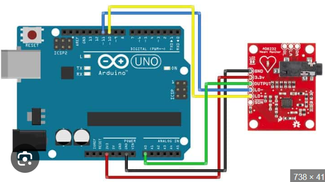

🔗 How It Works 
= The heartbeat sensor detects the pulse from the patient’s fingertip. 
= The Arduino Uno processes the signal and sends the heart rate data via serial communication. 
= The system stores and displays the data in real time on the patient dashboard. 

### 🖥️ The result will look like this:
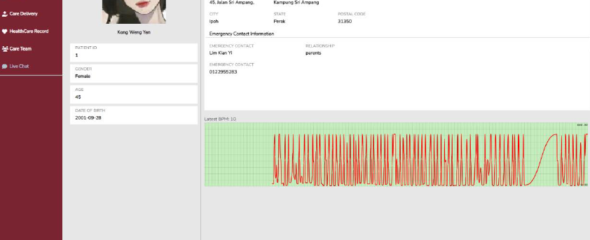

🛠️ Installation Guide 
1. Clone the Repository 
   - git clone https://github.com/kyiiiiiii/WebBasedHomecareSystem.git 
   - cd WebBasedHomecareSystem</li> 
    
2. Install Dependencies 
   - composer install 
   - npm install 

3. Configure Environment Variables 
   - Copy .env.example and rename it to .env 
   - Update database settings in .env (WAMP MySQL) 
   - Add your Pusher.js and Daily.co credentials 

4. Database Setup 
   - php artisan migrate --seed 

5. Start the Application 
   - php artisan serve 

Open http://127.0.0.1:8000 in your browser.

📜 Tech Stack 
🔹 Laravel 8 - Backend Framework 
🔹 Bootstrap 5 - UI Framework 
🔹 MySQL (WAMPServer) - Database 
🔹 Pusher.js - Real-time messaging 
🔹 Daily.co - Video calls 
🔹 JavaScript & jQuery - Frontend interactivity 

###📸 Sample Screenshots

### 🏠 Login Page  
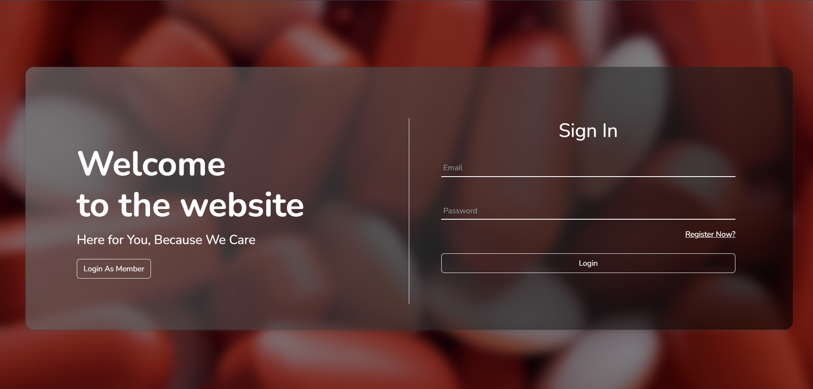  

### 🔹 Admin Dashboard  
  

### 📅 Appointment  
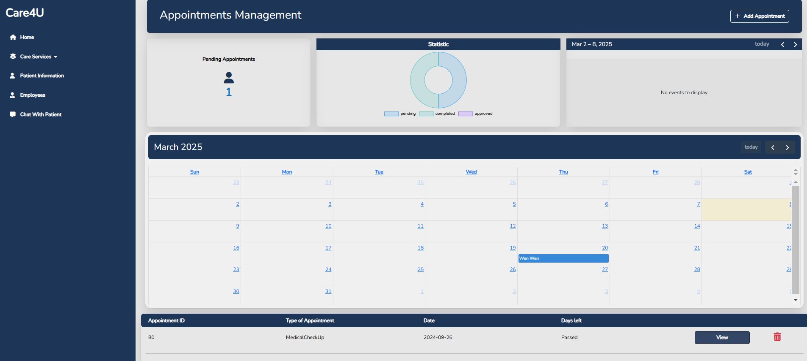  

### 🏥 Health Info  
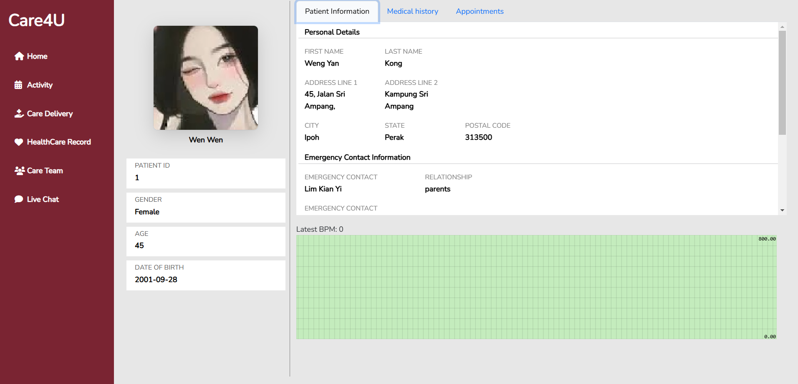  

### 💬 Messages  
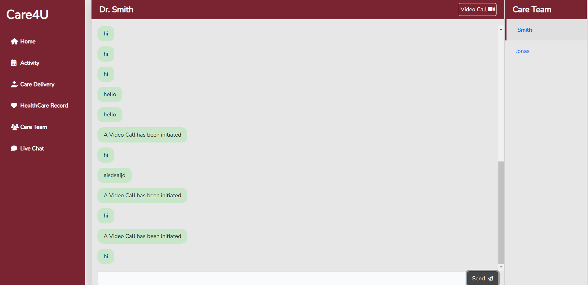  

### 🧑‍⚕️ Patient Dashboard  
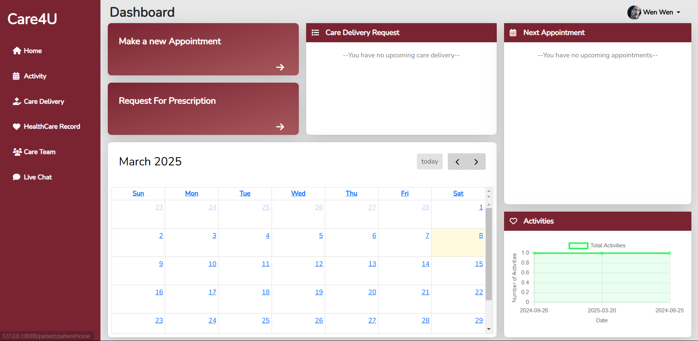  

### 📏 Responsiveness  
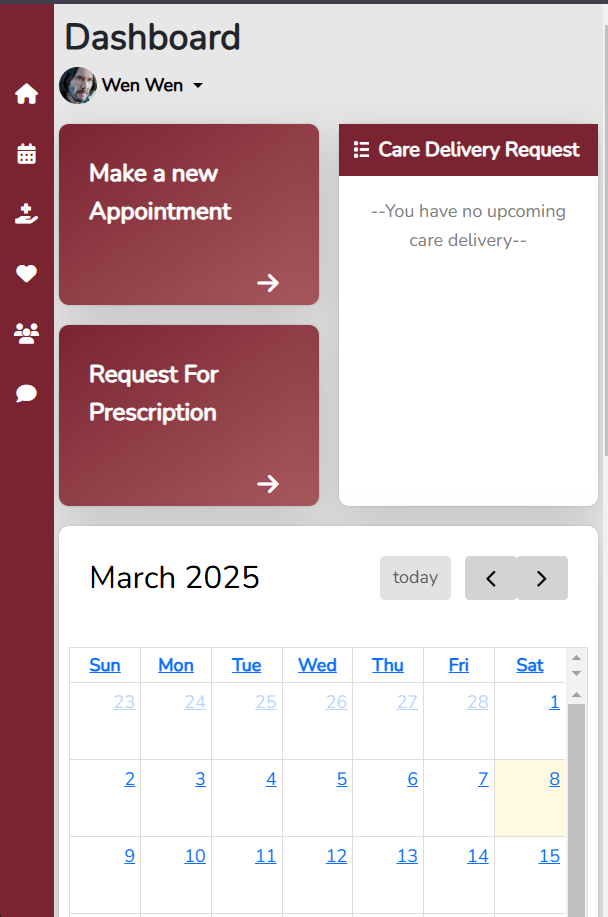  

### 🛠️ Services  
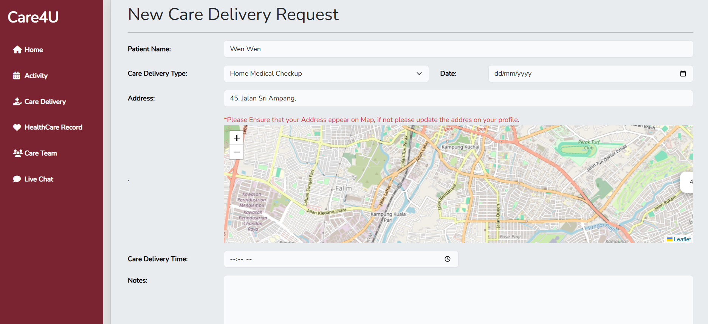  

### 🛠️ More Services  
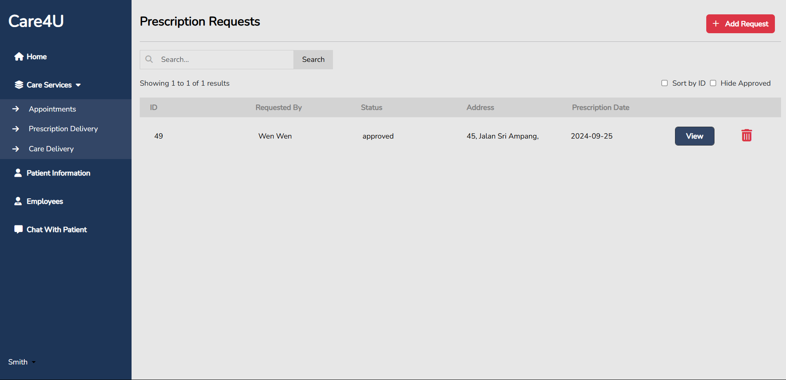  

### 📞 Video Call  
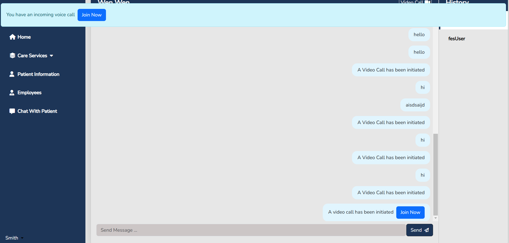  

